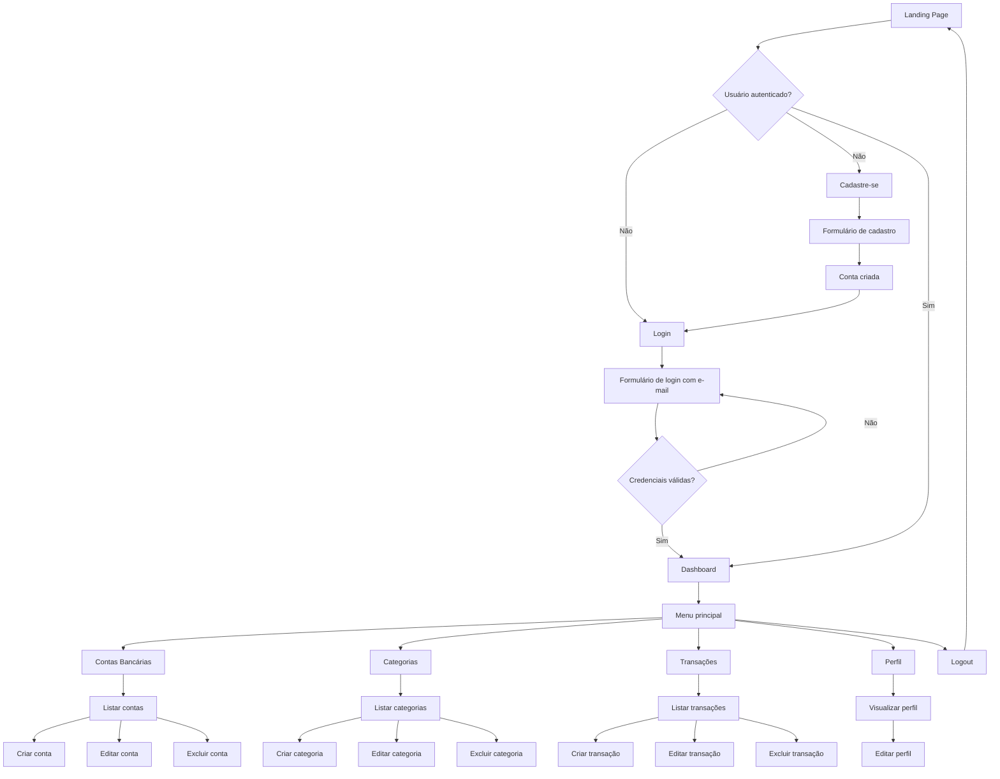
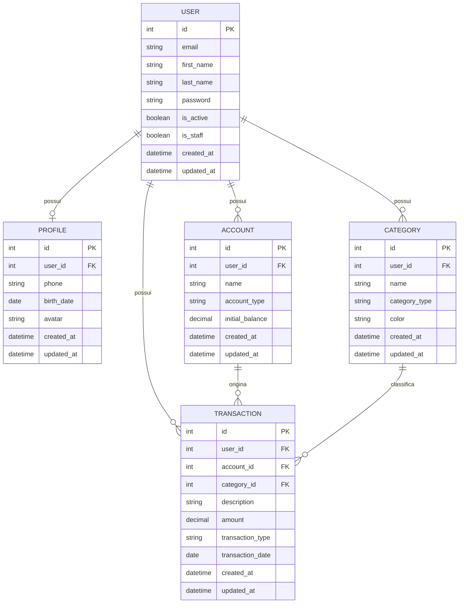

# PRD — Finanpy
### Product Requirement Document

---

## 1. Visão geral

**Finanpy** é um sistema web de gestão de finanças pessoais, desenvolvido em **Python + Django**, com frontend renderizado via **Django Template Language (DTL)** estilizado com **TailwindCSS**. O projeto segue uma abordagem enxuta, sem over engineering: banco de dados **SQLite**, autenticação **nativa do Django** (login por e-mail) e separação de domínios em **apps Django independentes**.

O objetivo é entregar uma ferramenta simples e funcional para que uma pessoa registre contas bancárias, categorize seus lançamentos financeiros e acompanhe entradas e saídas em um dashboard central.

---

## 2. Sobre o produto

Finanpy permite que o usuário:

- Crie uma conta e faça login usando e-mail e senha.
- Cadastre um perfil pessoal.
- Cadastre uma ou mais contas bancárias (carteira, conta corrente, poupança, etc).
- Cadastre categorias de receita e despesa, personalizadas.
- Registre transações (entradas e saídas) vinculadas a uma conta e a uma categoria.
- Visualize um dashboard com o resumo da sua situação financeira.

O sistema é **full stack Django**, sem API separada e sem frontend desacoplado (SPA). Toda a renderização é feita no servidor, com Tailwind aplicado diretamente nos templates.

---

## 3. Propósito

Oferecer uma solução simples, rápida de usar e visualmente moderna para que pessoas físicas organizem sua vida financeira, sem a complexidade de planilhas ou de sistemas financeiros corporativos.

---

## 4. Público alvo

- Pessoas físicas que desejam controlar receitas e despesas pessoais.
- Usuários que buscam uma alternativa simples a planilhas de controle financeiro.
- Usuários que preferem um sistema web leve, sem necessidade de instalar aplicativos.

---

## 5. Objetivos

- Permitir o cadastro e autenticação de usuários via e-mail.
- Permitir o gerenciamento de contas bancárias.
- Permitir o gerenciamento de categorias de transações.
- Permitir o registro e acompanhamento de transações financeiras.
- Exibir um dashboard consolidado com a situação financeira do usuário.
- Manter uma identidade visual única, moderna e consistente em todas as telas.
- Manter a base de código simples, legível e alinhada à PEP8.

---

## 6. Requisitos funcionais

### 6.1 Site público (landing page)

- RF01: Deve existir uma página inicial pública, acessível sem autenticação.
- RF02: A página inicial deve apresentar o produto (hero, benefícios, chamada para ação).
- RF03: A página inicial deve conter botões de **Cadastre-se** e **Login**.

### 6.2 Autenticação e usuários

- RF04: O usuário deve poder se cadastrar informando nome, e-mail e senha.
- RF05: O login deve ser feito através do e-mail (não do username).
- RF06: O usuário deve poder fazer logout.
- RF07: Após o login, o usuário deve ser redirecionado ao dashboard.
- RF08: Rotas internas do sistema devem exigir autenticação (redirecionar ao login se não autenticado).

### 6.3 Perfil

- RF09: O usuário deve poder visualizar e editar seu perfil (dados complementares ao usuário).

### 6.4 Contas bancárias

- RF10: O usuário deve poder cadastrar uma conta bancária (nome, tipo, saldo inicial).
- RF11: O usuário deve poder listar suas contas bancárias.
- RF12: O usuário deve poder editar uma conta bancária.
- RF13: O usuário deve poder excluir uma conta bancária.

### 6.5 Categorias

- RF14: O usuário deve poder cadastrar categorias de receita ou despesa.
- RF15: O usuário deve poder listar suas categorias.
- RF16: O usuário deve poder editar uma categoria.
- RF17: O usuário deve poder excluir uma categoria.

### 6.6 Transações

- RF18: O usuário deve poder registrar uma transação (valor, tipo, data, descrição, conta, categoria).
- RF19: O usuário deve poder listar suas transações, com filtros básicos (conta, categoria, tipo, período).
- RF20: O usuário deve poder editar uma transação.
- RF21: O usuário deve poder excluir uma transação.

### 6.7 Dashboard

- RF22: O dashboard deve exibir o saldo total consolidado das contas do usuário.
- RF23: O dashboard deve exibir o total de receitas e despesas do período.
- RF24: O dashboard deve exibir as últimas transações registradas.

### 6.8 Fluxograma de UX



---

## 7. Requisitos não-funcionais

- RNF01: O sistema deve utilizar Django full stack, sem frontend desacoplado.
- RNF02: O frontend deve ser construído com Django Template Language e TailwindCSS.
- RNF03: O sistema deve utilizar exclusivamente o banco de dados SQLite padrão do Django.
- RNF04: Todo model do sistema deve possuir os campos `created_at` e `updated_at`.
- RNF05: O código deve ser escrito em inglês (nomes de variáveis, funções, classes, comentários).
- RNF06: Toda informação exibida na interface deve estar em português brasileiro.
- RNF07: O código deve seguir a PEP8 e utilizar aspas simples sempre que possível.
- RNF08: O sistema deve priorizar Class Based Views e recursos nativos do Django.
- RNF09: Signals, quando utilizados, devem ficar em um arquivo `signals.py` dentro da app correspondente.
- RNF10: As entidades do sistema devem ser separadas em apps Django isoladas por responsabilidade.
- RNF11: O sistema deve ser responsivo (mobile, tablet, desktop).
- RNF12: Docker não deve ser implementado nas fases iniciais (reservado para sprint final).
- RNF13: Testes automatizados não devem ser implementados nas fases iniciais (reservado para sprint final).
- RNF14: O sistema não deve conter funcionalidades além das explicitamente solicitadas neste documento.

---

## 8. Arquitetura técnica

### 8.1 Stack

| Camada | Tecnologia |
|---|---|
| Linguagem | Python 3.12+ |
| Framework | Django (última versão estável) |
| Templates | Django Template Language (DTL) |
| Estilo | TailwindCSS |
| Banco de dados | SQLite (padrão do Django) |
| Autenticação | Sistema nativo do Django (`AbstractUser` customizado, login por e-mail) |
| Views | Class Based Views (`django.views.generic`) |
| Formulários | Django Forms / ModelForms |

### 8.2 Apps Django e responsabilidades

| App | Responsabilidade |
|---|---|
| `core` | Configurações globais do projeto (settings, urls, wsgi, asgi) e views públicas (landing page) |
| `users` | Model de usuário customizado (herdando `AbstractUser`), autenticação, login, cadastro e logout |
| `profiles` | Perfil complementar do usuário |
| `accounts` | Contas bancárias do usuário |
| `categories` | Categorias de receita/despesa |
| `transactions` | Lançamentos financeiros (entradas e saídas) |

### 8.3 Modelo de dados



### 8.4 Regras técnicas gerais

- O model `User` (app `users`) substitui o `User` padrão do Django via `AUTH_USER_MODEL`, com `USERNAME_FIELD = 'email'`.
- Um `manager` customizado (`UserManager`) é necessário para criação de usuários e superusuários via e-mail.
- Todos os models de domínio (`Account`, `Category`, `Transaction`, `Profile`) devem possuir um `ForeignKey`/`OneToOneField` para `User`.
- Um `abstract base model` (`TimeStampedModel`) pode ser criado em `core` para centralizar os campos `created_at` e `updated_at`, evitando repetição.

---

## 9. Design system

Identidade visual moderna, com gradientes suaves, paleta harmônica e fundo claro (não totalmente branco). Todos os componentes abaixo devem ser reutilizados em todas as telas do sistema, preferencialmente via templates base e ``/`` do Django.

### 9.1 Paleta de cores

| Uso | Classe Tailwind | Cor |
|---|---|---|
| Fundo geral da aplicação | `bg-slate-100` | Cinza claro azulado |
| Fundo de cards/painéis | `bg-white` | Branco |
| Gradiente primário (botões, header, destaques) | `bg-gradient-to-r from-indigo-600 to-purple-600` | Índigo → Roxo |
| Gradiente hover | `hover:from-indigo-700 hover:to-purple-700` | Índigo escuro → Roxo escuro |
| Texto principal | `text-slate-800` | Cinza escuro |
| Texto secundário | `text-slate-500` | Cinza médio |
| Sucesso / Receita | `text-emerald-600` / `bg-emerald-50` | Verde esmeralda |
| Erro / Despesa | `text-rose-600` / `bg-rose-50` | Vermelho rosado |
| Alerta | `text-amber-600` / `bg-amber-50` | Âmbar |
| Bordas | `border-slate-200` | Cinza claro |

### 9.2 Tipografia

- Fonte padrão: `font-sans` (stack padrão do Tailwind, ex: Inter/system-ui).
- Títulos de página: `text-2xl md:text-3xl font-bold text-slate-800`.
- Subtítulos de seção: `text-lg font-semibold text-slate-700`.
- Texto corrido: `text-sm text-slate-600`.
- Labels de formulário: `text-sm font-medium text-slate-700`.

### 9.3 Botões

**Botão primário (ação principal):**
```html
<button class="bg-gradient-to-r from-indigo-600 to-purple-600 hover:from-indigo-700 hover:to-purple-700 text-white font-medium px-4 py-2 rounded-lg shadow-sm transition-colors duration-200">
  Salvar
</button>
```

**Botão secundário:**
```html
<button class="bg-white border border-slate-300 text-slate-700 hover:bg-slate-50 font-medium px-4 py-2 rounded-lg transition-colors duration-200">
  Cancelar
</button>
```

**Botão de perigo (exclusão):**
```html
<button class="bg-rose-600 hover:bg-rose-700 text-white font-medium px-4 py-2 rounded-lg transition-colors duration-200">
  Excluir
</button>
```

### 9.4 Inputs e formulários

```html
<div class="mb-4">
  <label class="block text-sm font-medium text-slate-700 mb-1">Nome</label>
  <input type="text" class="w-full rounded-lg border border-slate-300 px-3 py-2 text-sm text-slate-800 focus:outline-none focus:ring-2 focus:ring-indigo-500 focus:border-transparent">
</div>
```

- Inputs sempre com `rounded-lg`, `border-slate-300` e `focus:ring-2 focus:ring-indigo-500`.
- Mensagens de erro: `text-rose-600 text-xs mt-1`.
- Formulários organizados em `<form>` com `space-y-4`.

### 9.5 Cards / Painéis

```html
<div class="bg-white rounded-xl shadow-sm border border-slate-200 p-6">
  <!-- conteúdo -->
</div>
```

### 9.6 Grid e layout

- Container principal: `max-w-7xl mx-auto px-4 sm:px-6 lg:px-8`.
- Grid de cards de resumo (dashboard): `grid grid-cols-1 md:grid-cols-3 gap-4`.
- Grid de listagens: `grid grid-cols-1 gap-4` com cards empilhados ou tabela responsiva.

### 9.7 Menu / navegação

**Sidebar (área autenticada), fixa em desktop e colapsável/off-canvas em mobile:**
```html
<aside class="w-64 bg-white border-r border-slate-200 min-h-screen">
  <div class="p-6 bg-gradient-to-r from-indigo-600 to-purple-600">
    <span class="text-white text-xl font-bold">Finanpy</span>
  </div>
  <nav class="p-4 space-y-1">
    <a href="#" class="flex items-center gap-3 px-3 py-2 rounded-lg text-slate-700 hover:bg-slate-100">Dashboard</a>
    <a href="#" class="flex items-center gap-3 px-3 py-2 rounded-lg text-slate-700 hover:bg-slate-100">Contas</a>
    <a href="#" class="flex items-center gap-3 px-3 py-2 rounded-lg text-slate-700 hover:bg-slate-100">Categorias</a>
    <a href="#" class="flex items-center gap-3 px-3 py-2 rounded-lg text-slate-700 hover:bg-slate-100">Transações</a>
    <a href="#" class="flex items-center gap-3 px-3 py-2 rounded-lg text-slate-700 hover:bg-slate-100">Perfil</a>
  </nav>
</aside>
```

- Item de menu ativo: adicionar `bg-indigo-50 text-indigo-700 font-medium`.
- Header público (landing page): `bg-white/80 backdrop-blur border-b border-slate-200` fixo no topo.

### 9.8 Padrão de templates Django

- `templates/base.html`: layout base com Tailwind (via CDN ou build), blocos ``, ``.
- `templates/partials/`: componentes reutilizáveis (`_navbar.html`, `_sidebar.html`, `_messages.html`, `_footer.html`).
- Cada app possui sua pasta `templates/<app_name>/` com suas próprias views (`list.html`, `form.html`, `detail.html`, `confirm_delete.html`).
- Mensagens do Django (`django.contrib.messages`) exibidas como toasts/alerts com cores semânticas (verde para sucesso, vermelho para erro).

---

## 10. User stories

### Épico 1 — Autenticação e usuários

**US01:** Como visitante, quero me cadastrar informando nome, e-mail e senha, para criar minha conta no Finanpy.
- Critérios de aceite:
  - O formulário de cadastro exige nome, e-mail e senha (com confirmação).
  - O e-mail deve ser único no sistema.
  - Após o cadastro, o usuário é redirecionado para a tela de login.

**US02:** Como usuário cadastrado, quero fazer login usando meu e-mail e senha, para acessar o sistema.
- Critérios de aceite:
  - O campo de login é o e-mail, não o username.
  - Credenciais inválidas exibem mensagem de erro.
  - Login bem-sucedido redireciona para o dashboard.

**US03:** Como usuário autenticado, quero fazer logout, para encerrar minha sessão com segurança.
- Critérios de aceite:
  - Ao clicar em "Sair", a sessão é encerrada.
  - O usuário é redirecionado para a landing page.

### Épico 2 — Perfil

**US04:** Como usuário autenticado, quero visualizar e editar meu perfil, para manter meus dados atualizados.
- Critérios de aceite:
  - A tela de perfil exibe telefone, data de nascimento e avatar (quando cadastrados).
  - As alterações são salvas e uma mensagem de sucesso é exibida.

### Épico 3 — Contas bancárias

**US05:** Como usuário autenticado, quero cadastrar uma conta bancária, para organizar meu dinheiro por origem.
- Critérios de aceite:
  - O formulário exige nome, tipo e saldo inicial.
  - A conta criada aparece na listagem do usuário.

**US06:** Como usuário autenticado, quero listar, editar e excluir minhas contas bancárias, para mantê-las atualizadas.
- Critérios de aceite:
  - A listagem exibe apenas as contas do usuário logado.
  - A exclusão exige confirmação.

### Épico 4 — Categorias

**US07:** Como usuário autenticado, quero cadastrar categorias de receita e despesa, para classificar minhas transações.
- Critérios de aceite:
  - O formulário exige nome e tipo (receita ou despesa).
  - A categoria criada aparece na listagem do usuário.

**US08:** Como usuário autenticado, quero editar e excluir minhas categorias, para mantê-las organizadas.
- Critérios de aceite:
  - A listagem exibe apenas as categorias do usuário logado.
  - A exclusão exige confirmação.

### Épico 5 — Transações

**US09:** Como usuário autenticado, quero registrar uma transação, para acompanhar minhas entradas e saídas.
- Critérios de aceite:
  - O formulário exige valor, tipo, data, conta e categoria; descrição é opcional.
  - A transação é vinculada à conta e categoria selecionadas.

**US10:** Como usuário autenticado, quero listar, filtrar, editar e excluir minhas transações, para manter meu controle financeiro correto.
- Critérios de aceite:
  - A listagem exibe apenas transações do usuário logado.
  - É possível filtrar por conta, categoria, tipo e período.
  - A exclusão exige confirmação.

### Épico 6 — Dashboard

**US11:** Como usuário autenticado, quero visualizar um dashboard com meu saldo consolidado e últimas movimentações, para ter uma visão geral da minha situação financeira.
- Critérios de aceite:
  - Exibe saldo total somando todas as contas.
  - Exibe total de receitas e despesas do período atual.
  - Exibe lista das últimas transações registradas.

### Épico 7 — Site público

**US12:** Como visitante, quero acessar uma landing page que explique o produto, para entender do que se trata antes de me cadastrar.
- Critérios de aceite:
  - A página é acessível sem login.
  - Contém botões visíveis de "Cadastre-se" e "Entrar".

---

## 11. Métricas de sucesso

### KPIs de produto

- Taxa de conclusão do cadastro (usuários que iniciam vs. finalizam o cadastro).
- Tempo médio para o primeiro lançamento de transação após o cadastro.
- Número médio de contas bancárias cadastradas por usuário.
- Número médio de transações registradas por usuário/mês.

### KPIs de usuário

- Taxa de retorno (usuários que fazem login mais de uma vez na semana).
- Taxa de abandono no fluxo de cadastro/login.
- Percentual de usuários que utilizam categorias personalizadas.

### KPIs técnicos

- Tempo médio de resposta das páginas principais (dashboard, listagens).
- Taxa de erros 4xx/5xx nas rotas autenticadas.

---

## 12. Riscos e mitigações

| Risco | Impacto | Mitigação |
|---|---|---|
| Complexidade crescente por adição de funcionalidades não previstas | Alto | Manter escopo restrito a este PRD; novas features exigem novo ciclo de planejamento |
| Inconsistência visual entre telas | Médio | Uso obrigatório de template base e componentes reutilizáveis (design system) |
| Falta de testes nas fases iniciais pode gerar regressões | Médio | Reservar sprint final dedicada exclusivamente a testes automatizados |
| Ausência de Docker pode gerar diferenças entre ambientes de desenvolvimento | Baixo | Documentar setup local claramente; Docker implementado em sprint final |
| Uso de SQLite pode limitar escalabilidade futura | Baixo | Aceitável para o escopo atual (uso pessoal); migração de banco pode ser avaliada futuramente |
| Login por e-mail exige customização do model de usuário, gerando risco de erro na migração inicial | Médio | Definir `AUTH_USER_MODEL` customizado antes da primeira migração do projeto |

---

## 13. Lista de tarefas

> Legenda: `[ ]` pendente · `[X]` concluído

### Sprint 0 — Setup do projeto

- [ ] **T0.1 — Estrutura inicial do projeto**
  - [x] T0.1.1 Criar ambiente virtual Python e instalar Django.
  - [x] T0.1.2 Criar projeto Django `core` com `django-admin startproject`.
  - [x] T0.1.3 Ajustar estrutura de pastas conforme arquitetura definida (apps na raiz, `core` como pasta de configuração).
  - [x] T0.1.4 Configurar `.gitignore` (ambiente virtual, `db.sqlite`, `__pycache__`, etc).
  - [x] T0.1.5 Criar arquivo `requirements.txt` com as dependências iniciais (Django).
- [x] **T0.2 — Criação das apps Django**
  - [x] T0.2.1 Criar app `users` com `startapp`.
  - [x] T0.2.2 Criar app `profiles` com `startapp`.
  - [x] T0.2.3 Criar app `accounts` com `startapp`.
  - [x] T0.2.4 Criar app `categories` com `startapp`.
  - [x] T0.2.5 Criar app `transactions` com `startapp`.
  - [x] T0.2.6 Registrar todas as apps em `INSTALLED_APPS` no `settings.py`.
- [ ] **T0.3 — Configuração base do settings**
  - [ ] T0.3.1 Configurar `TEMPLATES` para buscar templates em pasta global `templates/` na raiz do projeto.
  - [ ] T0.3.2 Configurar `STATICFILES_DIRS` e `STATIC_URL` para arquivos estáticos globais.
  - [ ] T0.3.3 Configurar idioma padrão (`LANGUAGE_CODE = 'pt-br'`) e timezone (`TIME_ZONE = 'America/Sao_Paulo'`).
  - [ ] T0.3.4 Configurar `LOGIN_URL`, `LOGIN_REDIRECT_URL` e `LOGOUT_REDIRECT_URL`.
- [ ] **T0.4 — Base model compartilhada**
  - [ ] T0.4.1 Criar model abstrato `TimeStampedModel` na app `core` com os campos `created_at` (auto_now_add) e `updated_at` (auto_now).
- [ ] **T0.5 — Configuração do TailwindCSS**
  - [ ] T0.5.1 Definir estratégia de integração do Tailwind (CDN para simplicidade do projeto).
  - [ ] T0.5.2 Criar `templates/base.html` incluindo o script/link do Tailwind.
  - [ ] T0.5.3 Definir paleta de cores e componentes base do design system no `base.html`.
- [ ] **T0.6 — Templates e partials base**
  - [ ] T0.6.1 Criar pasta `templates/partials/` com `_navbar.html`, `_sidebar.html`, `_messages.html` e `_footer.html`.
  - [ ] T0.6.2 Criar template `base_public.html` (para landing page/login/cadastro) sem sidebar.
  - [ ] T0.6.3 Criar template `base_app.html` (para área autenticada) com sidebar e header.

### Sprint 1 — Usuários e autenticação

- [ ] **T1.1 — Model de usuário customizado**
  - [ ] T1.1.1 Criar model `User` na app `users` herdando de `AbstractUser`.
  - [ ] T1.1.2 Remover/ajustar campo `username`, definindo `email` como `USERNAME_FIELD`.
  - [ ] T1.1.3 Definir `REQUIRED_FIELDS` (ex: `first_name`).
  - [ ] T1.1.4 Criar `UserManager` customizado com métodos `create_user` e `create_superuser` baseados em e-mail.
  - [ ] T1.1.5 Adicionar `created_at` e `updated_at` herdando de `TimeStampedModel`.
  - [ ] T1.1.6 Configurar `AUTH_USER_MODEL = 'users.User'` no `settings.py`.
  - [ ] T1.1.7 Gerar e aplicar migrações iniciais do model `User`.
- [ ] **T1.2 — Admin de usuários**
  - [ ] T1.2.1 Registrar model `User` no `admin.py` da app `users`, adaptando `UserAdmin` para uso do e-mail.
- [ ] **T1.3 — Cadastro de usuários (sign up)**
  - [ ] T1.3.1 Criar `UserCreationForm` customizado (e-mail, nome, senha e confirmação de senha).
  - [ ] T1.3.2 Criar `SignUpView` (Class Based View, `CreateView`) na app `users`.
  - [ ] T1.3.3 Criar template `users/signup.html` seguindo o design system (formulário centralizado, card branco sobre fundo `bg-slate-100`).
  - [ ] T1.3.4 Adicionar validação de e-mail único e mensagens de erro amigáveis.
  - [ ] T1.3.5 Redirecionar para tela de login após cadastro bem-sucedido, com mensagem de sucesso.
- [ ] **T1.4 — Login**
  - [ ] T1.4.1 Criar `AuthenticationForm` customizado utilizando e-mail como campo de login.
  - [ ] T1.4.2 Criar `LoginView` (baseada em `django.contrib.auth.views.LoginView`) com o form customizado.
  - [ ] T1.4.3 Criar template `users/login.html` seguindo o design system.
  - [ ] T1.4.4 Configurar redirecionamento para o dashboard após login bem-sucedido.
- [ ] **T1.5 — Logout**
  - [ ] T1.5.1 Configurar `LogoutView` nativa do Django.
  - [ ] T1.5.2 Adicionar botão/link de logout na sidebar.
- [ ] **T1.6 — Proteção de rotas**
  - [ ] T1.6.1 Aplicar `LoginRequiredMixin` em todas as views internas do sistema.
  - [ ] T1.6.2 Testar manualmente o redirecionamento de usuários não autenticados para o login.
- [ ] **T1.7 — URLs de autenticação**
  - [ ] T1.7.1 Criar `users/urls.py` com rotas de `signup`, `login` e `logout`.
  - [ ] T1.7.2 Incluir `users.urls` no `core/urls.py`.

### Sprint 2 — Perfis

- [ ] **T2.1 — Model de perfil**
  - [ ] T2.1.1 Criar model `Profile` na app `profiles`, herdando de `TimeStampedModel`.
  - [ ] T2.1.2 Adicionar `OneToOneField` para `User`.
  - [ ] T2.1.3 Adicionar campos `phone`, `birth_date` e `avatar` (opcionais).
  - [ ] T2.1.4 Gerar e aplicar migrações do model `Profile`.
- [ ] **T2.2 — Criação automática de perfil**
  - [ ] T2.2.1 Criar `profiles/signals.py` com signal `post_save` do model `User` para criar `Profile` automaticamente.
  - [ ] T2.2.2 Conectar o signal no `apps.py` da app `profiles` (`ready()`).
- [ ] **T2.3 — Admin de perfis**
  - [ ] T2.3.1 Registrar model `Profile` no `admin.py` da app `profiles`.
- [ ] **T2.4 — Visualização e edição de perfil**
  - [ ] T2.4.1 Criar `ProfileDetailView` (ou reaproveitar `UpdateView`) na app `profiles`.
  - [ ] T2.4.2 Criar `ProfileForm` (ModelForm) com os campos editáveis.
  - [ ] T2.4.3 Criar template `profiles/detail.html` seguindo o design system (card com dados do usuário e do perfil).
  - [ ] T2.4.4 Garantir que o usuário só possa editar o próprio perfil (`get_object` filtrando por `request.user`).
- [ ] **T2.5 — URLs de perfil**
  - [ ] T2.5.1 Criar `profiles/urls.py` com rota de visualização/edição do perfil.
  - [ ] T2.5.2 Incluir `profiles.urls` no `core/urls.py`.
  - [ ] T2.5.3 Adicionar link "Perfil" na sidebar.

### Sprint 3 — Contas bancárias

- [ ] **T3.1 — Model de conta bancária**
  - [ ] T3.1.1 Criar model `Account` na app `accounts`, herdando de `TimeStampedModel`.
  - [ ] T3.1.2 Adicionar `ForeignKey` para `User`.
  - [ ] T3.1.3 Adicionar campos `name`, `account_type` (choices) e `initial_balance`.
  - [ ] T3.1.4 Gerar e aplicar migrações do model `Account`.
- [ ] **T3.2 — Admin de contas**
  - [ ] T3.2.1 Registrar model `Account` no `admin.py` da app `accounts`.
- [ ] **T3.3 — Listagem de contas**
  - [ ] T3.3.1 Criar `AccountListView` (Class Based View, `ListView`) filtrando por `request.user`.
  - [ ] T3.3.2 Criar template `accounts/list.html` com grid de cards seguindo o design system.
- [ ] **T3.4 — Criação de conta**
  - [ ] T3.4.1 Criar `AccountForm` (ModelForm).
  - [ ] T3.4.2 Criar `AccountCreateView` (`CreateView`) associando a conta ao usuário logado.
  - [ ] T3.4.3 Criar template `accounts/form.html` reutilizável para criação e edição.
- [ ] **T3.5 — Edição de conta**
  - [ ] T3.5.1 Criar `AccountUpdateView` (`UpdateView`), restringindo o queryset ao usuário logado.
- [ ] **T3.6 — Exclusão de conta**
  - [ ] T3.6.1 Criar `AccountDeleteView` (`DeleteView`), restringindo o queryset ao usuário logado.
  - [ ] T3.6.2 Criar template `accounts/confirm_delete.html` de confirmação, seguindo o design system.
- [ ] **T3.7 — URLs de contas**
  - [ ] T3.7.1 Criar `accounts/urls.py` com rotas de listagem, criação, edição e exclusão.
  - [ ] T3.7.2 Incluir `accounts.urls` no `core/urls.py`.
  - [ ] T3.7.3 Adicionar link "Contas" na sidebar.

### Sprint 4 — Categorias

- [ ] **T4.1 — Model de categoria**
  - [ ] T4.1.1 Criar model `Category` na app `categories`, herdando de `TimeStampedModel`.
  - [ ] T4.1.2 Adicionar `ForeignKey` para `User`.
  - [ ] T4.1.3 Adicionar campos `name`, `category_type` (choices: receita/despesa) e `color`.
  - [ ] T4.1.4 Gerar e aplicar migrações do model `Category`.
- [ ] **T4.2 — Admin de categorias**
  - [ ] T4.2.1 Registrar model `Category` no `admin.py` da app `categories`.
- [ ] **T4.3 — Listagem de categorias**
  - [ ] T4.3.1 Criar `CategoryListView` (`ListView`) filtrando por `request.user`.
  - [ ] T4.3.2 Criar template `categories/list.html` com grid de cards coloridos por tipo (receita/despesa), seguindo o design system.
- [ ] **T4.4 — Criação de categoria**
  - [ ] T4.4.1 Criar `CategoryForm` (ModelForm).
  - [ ] T4.4.2 Criar `CategoryCreateView` (`CreateView`) associando a categoria ao usuário logado.
  - [ ] T4.4.3 Criar template `categories/form.html` reutilizável para criação e edição.
- [ ] **T4.5 — Edição de categoria**
  - [ ] T4.5.1 Criar `CategoryUpdateView` (`UpdateView`), restringindo o queryset ao usuário logado.
- [ ] **T4.6 — Exclusão de categoria**
  - [ ] T4.6.1 Criar `CategoryDeleteView` (`DeleteView`), restringindo o queryset ao usuário logado.
  - [ ] T4.6.2 Criar template `categories/confirm_delete.html` de confirmação.
- [ ] **T4.7 — URLs de categorias**
  - [ ] T4.7.1 Criar `categories/urls.py` com rotas de listagem, criação, edição e exclusão.
  - [ ] T4.7.2 Incluir `categories.urls` no `core/urls.py`.
  - [ ] T4.7.3 Adicionar link "Categorias" na sidebar.

### Sprint 5 — Transações

- [ ] **T5.1 — Model de transação**
  - [ ] T5.1.1 Criar model `Transaction` na app `transactions`, herdando de `TimeStampedModel`.
  - [ ] T5.1.2 Adicionar `ForeignKey` para `User`, `Account` e `Category`.
  - [ ] T5.1.3 Adicionar campos `description` (opcional), `amount`, `transaction_type` (choices) e `transaction_date`.
  - [ ] T5.1.4 Gerar e aplicar migrações do model `Transaction`.
- [ ] **T5.2 — Admin de transações**
  - [ ] T5.2.1 Registrar model `Transaction` no `admin.py` da app `transactions`.
- [ ] **T5.3 — Listagem de transações**
  - [ ] T5.3.1 Criar `TransactionListView` (`ListView`) filtrando por `request.user`.
  - [ ] T5.3.2 Implementar filtros via query params (conta, categoria, tipo, período) no `get_queryset`.
  - [ ] T5.3.3 Criar template `transactions/list.html` em formato de tabela responsiva, seguindo o design system.
  - [ ] T5.3.4 Adicionar formulário de filtro no topo da listagem (selects e campos de data).
- [ ] **T5.4 — Criação de transação**
  - [ ] T5.4.1 Criar `TransactionForm` (ModelForm), restringindo os `querysets` de conta/categoria ao usuário logado.
  - [ ] T5.4.2 Criar `TransactionCreateView` (`CreateView`) associando a transação ao usuário logado.
  - [ ] T5.4.3 Criar template `transactions/form.html` reutilizável para criação e edição.
- [ ] **T5.5 — Edição de transação**
  - [ ] T5.5.1 Criar `TransactionUpdateView` (`UpdateView`), restringindo o queryset ao usuário logado.
- [ ] **T5.6 — Exclusão de transação**
  - [ ] T5.6.1 Criar `TransactionDeleteView` (`DeleteView`), restringindo o queryset ao usuário logado.
  - [ ] T5.6.2 Criar template `transactions/confirm_delete.html` de confirmação.
- [ ] **T5.7 — URLs de transações**
  - [ ] T5.7.1 Criar `transactions/urls.py` com rotas de listagem, criação, edição e exclusão.
  - [ ] T5.7.2 Incluir `transactions.urls` no `core/urls.py`.
  - [ ] T5.7.3 Adicionar link "Transações" na sidebar.

### Sprint 6 — Dashboard

- [ ] **T6.1 — View do dashboard**
  - [ ] T6.1.1 Criar `DashboardView` (Class Based View, `TemplateView`) na app `core`.
  - [ ] T6.1.2 Calcular saldo total somando saldo inicial das contas e transações associadas.
  - [ ] T6.1.3 Calcular total de receitas e despesas do período atual (mês corrente).
  - [ ] T6.1.4 Obter as últimas transações registradas (ex: últimas 5).
- [ ] **T6.2 — Template do dashboard**
  - [ ] T6.2.1 Criar template `core/dashboard.html` seguindo o design system.
  - [ ] T6.2.2 Criar cards de resumo (saldo total, receitas do período, despesas do período) em grid responsivo.
  - [ ] T6.2.3 Criar seção de últimas transações em formato de lista/tabela.
- [ ] **T6.3 — URL do dashboard**
  - [ ] T6.3.1 Criar rota `dashboard/` no `core/urls.py`, protegida por `LoginRequiredMixin`.
  - [ ] T6.3.2 Adicionar link "Dashboard" na sidebar (item ativo por padrão).

### Sprint 7 — Site público (landing page)

- [ ] **T7.1 — View da landing page**
  - [ ] T7.1.1 Criar `LandingPageView` (`TemplateView`) na app `core`, acessível sem autenticação.
  - [ ] T7.1.2 Redirecionar usuários já autenticados diretamente para o dashboard.
- [ ] **T7.2 — Template da landing page**
  - [ ] T7.2.1 Criar template `core/landing.html` com seção hero (título, subtítulo, gradiente de fundo).
  - [ ] T7.2.2 Adicionar seção de benefícios/funcionalidades do produto.
  - [ ] T7.2.3 Adicionar header público com botões "Cadastre-se" e "Entrar".
  - [ ] T7.2.4 Adicionar footer simples.
- [ ] **T7.3 — URL da landing page**
  - [ ] T7.3.1 Configurar rota raiz (`/`) apontando para `LandingPageView`.

### Sprint 8 — Consistência visual e refinamento do design system

- [ ] **T8.1 — Revisão geral de componentes**
  - [ ] T8.1.1 Revisar todos os templates para garantir uso consistente das classes de botões, inputs e cards definidas no design system.
  - [ ] T8.1.2 Padronizar espaçamentos (`p-`, `m-`, `gap-`) entre todas as telas.
- [ ] **T8.2 — Mensagens e feedback ao usuário**
  - [ ] T8.2.1 Padronizar exibição das mensagens do Django (`messages`) como alerts/toasts no `_messages.html`.
  - [ ] T8.2.2 Aplicar cores semânticas (sucesso, erro, alerta) conforme design system.
- [ ] **T8.3 — Responsividade**
  - [ ] T8.3.1 Validar responsividade da sidebar em telas mobile (menu off-canvas).
  - [ ] T8.3.2 Validar responsividade das listagens (tabelas viram cards em telas pequenas, quando necessário).
  - [ ] T8.3.3 Validar responsividade dos formulários em telas pequenas.
- [ ] **T8.4 — Estados vazios**
  - [ ] T8.4.1 Criar componente de "estado vazio" (empty state) para listagens sem registros (contas, categorias, transações).

### Sprint 9 (final) — Dockerização

- [ ] **T9.1 — Containerização**
  - [ ] T9.1.1 Criar `Dockerfile` para a aplicação Django.
  - [ ] T9.1.2 Criar `docker-compose.yml` para orquestrar o serviço da aplicação.
  - [ ] T9.1.3 Configurar variáveis de ambiente via arquivo `.env`.
  - [ ] T9.1.4 Documentar comandos de build e execução via Docker no `README.md`.

### Sprint 10 (final) — Testes automatizados

- [ ] **T10.1 — Testes de models**
  - [ ] T10.1.1 Escrever testes unitários para os models `User`, `Profile`, `Account`, `Category` e `Transaction`.
- [ ] **T10.2 — Testes de views**
  - [ ] T10.2.1 Escrever testes de autenticação (cadastro, login, logout).
  - [ ] T10.2.2 Escrever testes de CRUD para contas bancárias.
  - [ ] T10.2.3 Escrever testes de CRUD para categorias.
  - [ ] T10.2.4 Escrever testes de CRUD para transações.
  - [ ] T10.2.5 Escrever testes do dashboard (cálculo de saldo e totais).
- [ ] **T10.3 — Testes de permissão**
  - [ ] T10.3.1 Garantir, via testes, que um usuário não acessa/edita/exclui dados de outro usuário.
